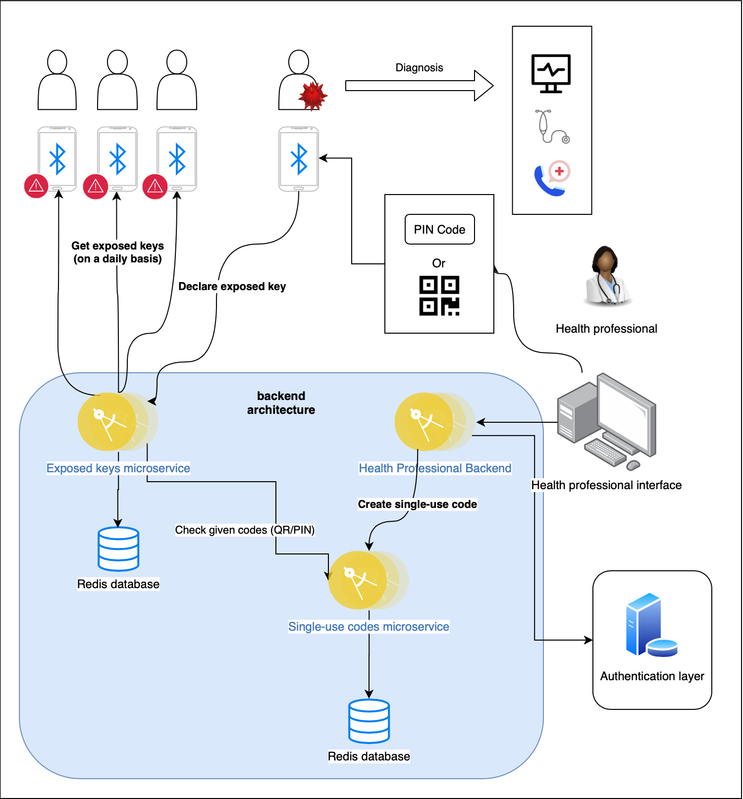
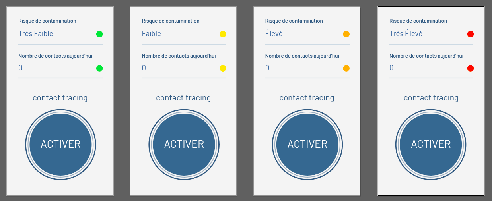

**Application de traçage numérique éthique et Open Source, alimentée par les contributeurs et la communauté.**

Le traçage numérique sur smarpthone possède le potentiel de limiter la propagation de la maladie Covid19 au sein de la population. Une application mobile dédiée, développée dans les règles de l'art, pourrait nous permettre de conserver un semblant de vie normale, malgré les mesures de confinement et de prévention que nous devons suivre:
* Les personnes pourrait être rapidement informées lorsqu'elles se sont tenues trop longtemps à proximité d'une personne infectée
* Les personnes pourrait recevoir des instructions sur les mesures à prendre de la part des autorités de santé publique
* Les épidémiologistes pourraient recevoir des informations de recherche anonymes ou pseudonymes, illustrant la propagation de la maladie, de la part d'utilisateurs volontaires

## Pourquoi OpenStopcovid ?

Un certain nombre de difficultés accompagnent la problématique du traçage numérique:
* L'utilisation de Bluetooth LE (Low Energy) pour la détection de proximité entre téléphones mobiles, implique de rester conforme aux standards existants.
* La préservation de la vie privée impose d'encrypter les données personnelles et d'en démanteler l'accès et le stockage dès qu'elles ne sont plus nécessaires.

Récemment, différentes initiatives ont vu le jour, avec à chaque fois l'ambition de pallier ces difficultés techniques. Les plus célèbres sont: 
* [BlueTrace](https://bluetrace.io/) développé par le gouvernement de Singapour
* [DP-3T](https://github.com/DP-3T/documents) proposé par l'École polytechnique fédérale de Lausanne (EPFL)
* [ROBERT](https://github.com/ROBERT-proximity-tracing/documents) issu du projet paneuropéen de recherche de proximité avec préservation de la vie privée (PEPP-PT).

**BlueTrace**. Bien que tous les protocoles aient été publiés publiquement, à ce jour seul BlueTrace propose une [implémentation de référence](https://github.com/OpenTrace-community). Toutefois, ce protocole est apparu **avant** que Google et Apple n'annoncent conjointement un [framework spécifique](https://www.apple.com/covid19/contacttracing) de développement destiné aux applications de traçage numérique, ce qui le rend en partie incompatible. Par ailleurs, BlueTrace est étroitement lié à un fournisseur de services Cloud particulier. Or nous pensons qu'une solution universelle doit être complètement indépendante.

**ROBERT**. Jusqu'à présent, aucune mise en œuvre de référence n'a été publiée pour ROBERT. Des rapprochements ont eu lieu avec des entreprises privilégiant généralement les logiciels propriétaires. De plus, le choix d'une approche centralisée rend ce protocole en partie incompatible avec le framework de traçage numérique imposé par Google et Apple.

**DP-3T**. Nous pensons fermement qu'une application doit être 100% Open Source, facile à installer et Cloud-agnostique. En conséquence, nous avons choisi [DP-3T](https://github.com/DP-3T/documents) comme technologie sous-jacente pour notre implémentation de référence. En effet, DP-3T réunit les trois conditions indispensables que nous avons cité. Par ce moyen, nous souhaitons sécuriser les utilisateurs, accroître leur confiance et permettre un déploiement à grande échelle d'une application à la hauteur des enjeux.

## De quoi se compose OpenStopCovid ?

L'architecture globale, directement inspirée du protocole DP3T, est représentée par le schéma suivant :



Les principales composantes du projet sont les suivantes :

* [Serveur de microservices](https://github.com/OpenStopCovid/dp3t-ms)
  - Microservice exposed-keys [pour les utilisateurs] :  pour publier les clés exposées et obtenir une liste des clés exposées
  - Microservice codes [pour les médecins] : pour créer et utiliser des codes de validation destinés à déclarer les patients malades
<br>
<br>
* [Application Android](https://github.com/fmauquie/react-native-dp3t-sdk) s'appuyant sur le [DP-3T SDK](https://github.com/DP-3T/dp3t-sdk-android)
* [Application iOS](https://github.com/fmauquie/react-native-dp3t-sdk) s'appuyant sur le [DP-3T SDK](https://github.com/DP-3T/dp3t-sdk-ios)
<br>
<br>

<br>
<br>
* [Interface utilisateur pour les médecins](https://github.com/OpenStopCovid/health-authority-ui) 
  - Interface principale pour les professionnels de santé
  - Vise à  générer des codes de validation pour les patients malades
<hr>

<hr>

<hr>

<hr>


## Pour faire tourner ce site en local
```
git clone https://github.com/OpenStopCovid/openstopcovid.github.io.git
cd openstopcovid.github.io
git checkout fr  # optionnel : sélectionnez une branche existante (fr, en ou master)
bundle install
bundle exec jekyll serve
# connectez votre navigateur à l'adresse suivante : http://localhost:4000
```
